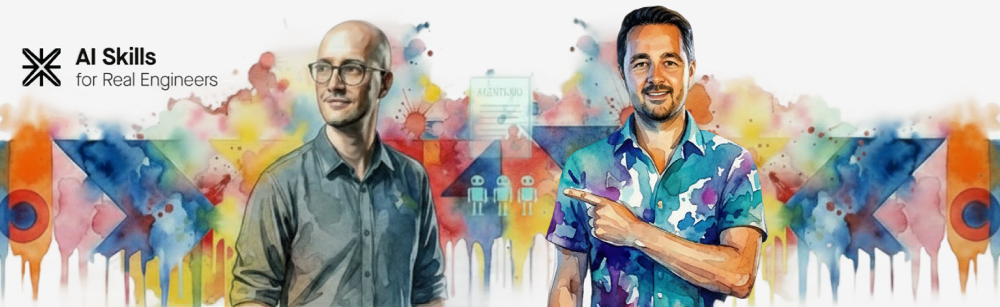

<p>
  
</p>

# Skills For Real Engineers — LittleBranches Fork

[](https://skills.sh/mattpocock/skills)

> **This is a fork of [mattpocock/skills](https://github.com/mattpocock/skills)** by [Matt Pocock](https://github.com/mattpocock).
> The original skills are unchanged and fully included here.
> This fork adds purpose-built skills designed to work alongside the
> [LittleBranches OSS Quality Standards](https://github.com/LittleBranches/oss-quality-standards).

## What this fork adds

| Skill | What it does |
| --- | --- |
| [`/create-giselle-component`](./skills/engineering/create-giselle-component/SKILL.md) | Scaffold and TDD a new giselle-mui component following OSS Quality Standards rules — two-phase: scaffold first (types, test stubs, README, roadmap), then implement one vertical slice at a time. |
| [`/audit-giselle-tests`](./skills/engineering/audit-giselle-tests/SKILL.md) | Classify and systematically fix AI-generated tests that use the MUI-mocking anti-pattern (`vi.mock('@mui/material/...')`), replacing them with real-ThemeProvider tests via `renderWithTheme`. |
| [`/morning-pr-sweep`](./skills/engineering/morning-pr-sweep/SKILL.md) | Clear all open PR review debt across every LittleBranches repo in one morning session — discover all open PRs, triage all threads before touching any code, batch fixes into one commit per PR, post SHA confirmations, and report which PRs are merge-ready. |
| [`/respond-pr-review`](./skills/engineering/respond-pr-review/SKILL.md) | Respond to an existing Copilot PR review in any repo — discover local review-response rules, triage every thread, reply inline before fixing, batch valid fixes into one commit, and post SHA follow-ups. |
| [`/respond-giselle-pr-review`](./skills/engineering/respond-giselle-pr-review/SKILL.md) | Respond to an existing Copilot PR review in a LittleBranches repo — pre-load the public and private AGENTS.md barrels plus the review workflow, triage every thread, reply inline before fixing, batch valid fixes, and post SHA follow-ups. |
| [`/review-giselle-pr`](./skills/engineering/review-giselle-pr/SKILL.md) | Review an open GitHub PR in any LittleBranches repo — pre-loads the public and private AGENTS.md barrels, maps each changed file to the relevant sections, posts findings via the GitHub PR Reviews API with inline line comments. |
| [`/review-pr`](./skills/engineering/review-pr/SKILL.md) | Review any open GitHub PR — dynamically discovers the repo's own standards docs (AGENTS.md, CLAUDE.md, ADRs), runs parallel Standards + Spec sub-agents, posts via the GitHub PR Reviews API. |
| [`/create-react-component`](./skills/engineering/create-react-component/SKILL.md) | Scaffold and TDD a new React component — no framework dependency, plain RTL, same two-phase scaffold/TDD workflow. |
| [`/create-vue-component`](./skills/engineering/create-vue-component/SKILL.md) | Scaffold and TDD a new Vue 3 standalone component — `<script setup>`, `defineProps` generics, `@testing-library/vue`. |
| [`/create-angular-component`](./skills/engineering/create-angular-component/SKILL.md) | Scaffold and TDD a new Angular 17+ standalone component — signal-based `input()`/`output()`, `OnPush`, Angular Testing Library. |
| [`/standup-prep`](./skills/engineering/standup-prep/SKILL.md) | Daily session startup coordinator. Runs preflight → session context → repo status + WIP sweep → open PR sweep → morning brief → file write → Asana sync. |
| [`/standup-prep-preflight`](./skills/engineering/standup-prep-preflight/SKILL.md) | Composite pre-flight: runs `/check-prior-work`, `/load-oss-standards`, and `/load-dependency-chain` in sequence. |
| [`/check-prior-work`](./skills/engineering/check-prior-work/SKILL.md) | Scans context for a `<conversation-summary>` block and extracts earlier session work for continuity before standup. |
| [`/load-oss-standards`](./skills/engineering/load-oss-standards/SKILL.md) | Verify access to public and private LittleBranches AGENTS.md files and print the session health table. |
| [`/load-dependency-chain`](./skills/engineering/load-dependency-chain/SKILL.md) | Read `dependency-chain.md` and extract the hard deadline, critical path, and current phase status for each active repo. |
| [`/load-session-context`](./skills/engineering/load-session-context/SKILL.md) | Load the session index and latest wrap file only; check for an existing morning brief for today. |
| [`/repo-status`](./skills/engineering/repo-status/SKILL.md) | Dynamically discover all workspace repos and produce a dirty state table (branch, dirty file count, clean/uncommitted). |
| [`/wip-sweep`](./skills/engineering/wip-sweep/SKILL.md) | Scope selection + tiered WIP commit/push/PR model: T1 scope selection → T2 local commit → T3 push → T4 draft PRs. |
| [`/open-pr-sweep`](./skills/engineering/open-pr-sweep/SKILL.md) | Discover all non-draft open PRs across LittleBranches and AlexRebula orgs and output a summary table. |
| [`/asana-sync`](./skills/engineering/asana-sync/SKILL.md) | Opt-in Asana sync: locate config, check write access, create Morning Briefs section, seed tasks, post status update, log results. |

### Why this fork exists

The original `mattpocock/skills` repo governs **how AI agents are used** — planning, TDD loops, grilling sessions, architecture reviews. It is model-agnostic and project-agnostic by design.

This fork adds skills that are specific to:

1. **giselle-mui** — a MUI-based React component library with a strict two-phase scaffold convention, role-based file naming, `types.ts`-first props contracts, and Storybook title taxonomy that mirrors folder paths.
2. **LittleBranches OSS Quality Standards** — a central `AGENTS.md`-driven quality gate that covers structure, naming, testing, accessibility, API contracts, and security. The custom skills enforce this standard during component creation, not after.

These skills are deliberately not upstreamed to `mattpocock/skills` — they encode project-specific decisions that would be noise for other consumers.

### Installing this fork

```bash
npx skills@latest add AlexRebula/skills
```

Then run `/setup-matt-pocock-skills` once per repo to configure the issue tracker, domain docs, and triage labels.

---

My agent skills that I use every day to do real engineering - not vibe coding.

Developing real applications is hard. Approaches like GSD, BMAD, and Spec-Kit try to help by owning the process. But while doing so, they take away your control and make bugs in the process hard to resolve.

These skills are designed to be small, easy to adapt, and composable. They work with any model. They're based on decades of engineering experience. Hack around with them. Make them your own. Enjoy.

If you want to keep up with changes to these skills, and any new ones I create, you can join ~60,000 other devs on my newsletter:

[Sign Up To The Newsletter](https://www.aihero.dev/s/skills-newsletter)

## Quickstart (30-second setup)

1. Run the skills.sh installer:

```bash
npx skills@latest add mattpocock/skills
```

2. Pick the skills you want, and which coding agents you want to install them on. **Make sure you select `/setup-matt-pocock-skills`**.

3. Run `/setup-matt-pocock-skills` in your agent. It will:
   - Ask you which issue tracker you want to use (GitHub, Linear, or local files)
   - Ask you what labels you apply to tickets when you triage them (`/triage` uses labels)
   - Ask you where you want to save any docs we create

4. Bam - you're ready to go.

## Why These Skills Exist

I built these skills as a way to fix common failure modes I see with Claude Code, Codex, and other coding agents.

### #1: The Agent Didn't Do What I Want

> "No-one knows exactly what they want"
>
> David Thomas & Andrew Hunt, [The Pragmatic Programmer](https://www.amazon.co.uk/Pragmatic-Programmer-Anniversary-Journey-Mastery/dp/B0833F1T3V)

**The Problem**. The most common failure mode in software development is misalignment. You think the dev knows what you want. Then you see what they've built - and you realize it didn't understand you at all.

This is just the same in the AI age. There is a communication gap between you and the agent. The fix for this is a **grilling session** - getting the agent to ask you detailed questions about what you're building.

**The Fix** is to use:

- [`/grill-me`](./skills/productivity/grill-me/SKILL.md) - for non-code uses
- [`/grill-with-docs`](./skills/engineering/grill-with-docs/SKILL.md) - same as [`/grill-me`](./skills/productivity/grill-me/SKILL.md), but adds more goodies (see below)

These are my most popular skills. They help you align with the agent before you get started, and think deeply about the change you're making. Use them _every_ time you want to make a change.

### #2: The Agent Is Way Too Verbose

> With a ubiquitous language, conversations among developers and expressions of the code are all derived from the same domain model.
>
> Eric Evans, [Domain-Driven-Design](https://www.amazon.co.uk/Domain-Driven-Design-Tackling-Complexity-Software/dp/0321125215)

**The Problem**: At the start of a project, devs and the people they're building the software for (the domain experts) are usually speaking different languages.

I felt the same tension with my agents. Agents are usually dropped into a project and asked to figure out the jargon as they go. So they use 20 words where 1 will do.

**The Fix** for this is a shared language. It's a document that helps agents decode the jargon used in the project.

<details>
<summary>
Example
</summary>

Here's an example [`CONTEXT.md`](https://github.com/mattpocock/course-video-manager/blob/076a5a7a182db0fe1e62971dd7a68bcadf010f1c/CONTEXT.md), from my `course-video-manager` repo. Which one is easier to read?

- **BEFORE**: "There's a problem when a lesson inside a section of a course is made 'real' (i.e. given a spot in the file system)"
- **AFTER**: "There's a problem with the materialization cascade"

This concision pays off session after session.

</details>

This is built into [`/grill-with-docs`](./skills/engineering/grill-with-docs/SKILL.md). It's a grilling session, but that helps you build a shared language with the AI, and document hard-to-explain decisions in ADR's.

It's hard to explain how powerful this is. It might be the single coolest technique in this repo. Try it, and see.

> [!TIP]
> A shared language has many other benefits than reducing verbosity:
>
> - **Variables, functions and files are named consistently**, using the shared language
> - As a result, the **codebase is easier to navigate** for the agent
> - The agent also **spends fewer tokens on thinking**, because it has access to a more concise language

### #3: The Code Doesn't Work

> "Always take small, deliberate steps. The rate of feedback is your speed limit. Never take on a task that’s too big."
>
> David Thomas & Andrew Hunt, [The Pragmatic Programmer](https://www.amazon.co.uk/Pragmatic-Programmer-Anniversary-Journey-Mastery/dp/B0833F1T3V)

**The Problem**: Let's say that you and the agent are aligned on what to build. What happens when the agent _still_ produces crap?

It's time to look at your feedback loops. Without feedback on how the code it produces actually runs, the agent will be flying blind.

**The Fix**: You need the usual tranche of feedback loops: static types, browser access, and automated tests.

For automated tests, a red-green-refactor loop is critical. This is where the agent writes a failing test first, then fixes the test. This helps give the agent a consistent level of feedback that results in far better code.

I've built a **[`/tdd`](./skills/engineering/tdd/SKILL.md) skill** you can slot into any project. It encourages red-green-refactor and gives the agent plenty of guidance on what makes good and bad tests.

For debugging, I've also built a **[`/diagnose`](./skills/engineering/diagnose/SKILL.md)** skill that wraps best debugging practices into a simple loop.

### #4: We Built A Ball Of Mud

> "Invest in the design of the system _every day_."
>
> Kent Beck, [Extreme Programming Explained](https://www.amazon.co.uk/Extreme-Programming-Explained-Embrace-Change/dp/0321278658)

> "The best modules are deep. They allow a lot of functionality to be accessed through a simple interface."
>
> John Ousterhout, [A Philosophy Of Software Design](https://www.amazon.co.uk/Philosophy-Software-Design-2nd/dp/173210221X)

**The Problem**: Most apps built with agents are complex and hard to change. Because agents can radically speed up coding, they also accelerate software entropy. Codebases get more complex at an unprecedented rate.

**The Fix** for this is a radical new approach to AI-powered development: caring about the design of the code.

This is built in to every layer of these skills:

- [`/to-prd`](./skills/engineering/to-prd/SKILL.md) quizzes you about which modules you're touching before creating a PRD
- [`/zoom-out`](./skills/engineering/zoom-out/SKILL.md) tells the agent to explain code in the context of the whole system

And crucially, [`/improve-codebase-architecture`](./skills/engineering/improve-codebase-architecture/SKILL.md) helps you rescue a codebase that has become a ball of mud. I recommend running it on your codebase once every few days.

### Summary

Software engineering fundamentals matter more than ever. These skills are my best effort at condensing these fundamentals into repeatable practices, to help you ship the best apps of your career. Enjoy.

## Reference

### giselle-mui (LittleBranches fork additions)

Skills for the giselle-mui component library and LittleBranches OSS Quality Standards.

- **[create-giselle-component](./skills/engineering/create-giselle-component/SKILL.md)** — Scaffold and TDD a new giselle-mui component in two phases: scaffold (types, test stubs, README, roadmap) then implement (TDD vertical slices with real ThemeProvider).
- **[create-react-component](./skills/engineering/create-react-component/SKILL.md)** — Scaffold and TDD a new React component (no MUI dependency) — same two-phase workflow.
- **[create-vue-component](./skills/engineering/create-vue-component/SKILL.md)** — Scaffold and TDD a new Vue 3 component with `<script setup>` and `@testing-library/vue`.
- **[create-angular-component](./skills/engineering/create-angular-component/SKILL.md)** — Scaffold and TDD a new Angular 17+ standalone component with signal-based inputs/outputs.
- **[audit-giselle-tests](./skills/engineering/audit-giselle-tests/SKILL.md)** — Classify AI-generated tests into three buckets and fix the MUI-mocking anti-pattern by replacing `vi.mock` with `renderWithTheme`.
- **[review-giselle-pr](./skills/engineering/review-giselle-pr/SKILL.md)** — Review a LittleBranches GitHub PR against oss-quality-standards AGENTS.md with inline GitHub Reviews API comments.
- **[respond-giselle-pr-review](./skills/engineering/respond-giselle-pr-review/SKILL.md)** — Respond to an existing Copilot review on a LittleBranches PR — preload AGENTS.md + workflow rules, triage every thread, reply before fixing, batch valid fixes, and post SHA follow-ups.
- **[respond-pr-review](./skills/engineering/respond-pr-review/SKILL.md)** — Respond to an existing Copilot review in any repo — discover local review-response rules, triage every thread, reply before fixing, batch valid fixes, and post SHA follow-ups.
- **[review-pr](./skills/engineering/review-pr/SKILL.md)** — Review any GitHub PR — discovers repo standards dynamically, runs parallel Standards + Spec sub-agents, posts inline reviews.
- **[review](./skills/in-progress/review/SKILL.md)** — Local diff review before a PR opens — two-axis (Standards + Spec), parallel sub-agents, no GitHub API.

### Engineering

Skills I use daily for code work.

- **[diagnose](./skills/engineering/diagnose/SKILL.md)** — Disciplined diagnosis loop for hard bugs and performance regressions: reproduce → minimise → hypothesise → instrument → fix → regression-test.
- **[grill-with-docs](./skills/engineering/grill-with-docs/SKILL.md)** — Grilling session that challenges your plan against the existing domain model, sharpens terminology, and updates `CONTEXT.md` and ADRs inline.
- **[triage](./skills/engineering/triage/SKILL.md)** — Triage issues through a state machine of triage roles.
- **[improve-codebase-architecture](./skills/engineering/improve-codebase-architecture/SKILL.md)** — Find deepening opportunities in a codebase, informed by the domain language in `CONTEXT.md` and the decisions in `docs/adr/`.
- **[setup-matt-pocock-skills](./skills/engineering/setup-matt-pocock-skills/SKILL.md)** — Scaffold the per-repo config (issue tracker, triage label vocabulary, domain doc layout) that the other engineering skills consume. Run once per repo before using `to-issues`, `to-prd`, `triage`, `diagnose`, `tdd`, `improve-codebase-architecture`, or `zoom-out`.
- **[tdd](./skills/engineering/tdd/SKILL.md)** — Test-driven development with a red-green-refactor loop. Builds features or fixes bugs one vertical slice at a time.
- **[to-issues](./skills/engineering/to-issues/SKILL.md)** — Break any plan, spec, or PRD into independently-grabbable GitHub issues using vertical slices.
- **[to-prd](./skills/engineering/to-prd/SKILL.md)** — Turn the current conversation context into a PRD and submit it as a GitHub issue. No interview — just synthesizes what you've already discussed.
- **[zoom-out](./skills/engineering/zoom-out/SKILL.md)** — Tell the agent to zoom out and give broader context or a higher-level perspective on an unfamiliar section of code.
- **[prototype](./skills/engineering/prototype/SKILL.md)** — Build a throwaway prototype to flesh out a design — either a runnable terminal app for state/business-logic questions, or several radically different UI variations toggleable from one route.

### Productivity

General workflow tools, not code-specific.

- **[caveman](./skills/productivity/caveman/SKILL.md)** — Ultra-compressed communication mode. Cuts token usage ~75% by dropping filler while keeping full technical accuracy.
- **[grill-me](./skills/productivity/grill-me/SKILL.md)** — Get relentlessly interviewed about a plan or design until every branch of the decision tree is resolved.
- **[handoff](./skills/productivity/handoff/SKILL.md)** — Compact the current conversation into a handoff document so another agent can continue the work.
- **[write-a-skill](./skills/productivity/write-a-skill/SKILL.md)** — Create new skills with proper structure, progressive disclosure, and bundled resources.

### Misc

Tools I keep around but rarely use.

- **[git-guardrails-claude-code](./skills/misc/git-guardrails-claude-code/SKILL.md)** — Set up Claude Code hooks to block dangerous git commands (push, reset --hard, clean, etc.) before they execute.
- **[migrate-to-shoehorn](./skills/misc/migrate-to-shoehorn/SKILL.md)** — Migrate test files from `as` type assertions to @total-typescript/shoehorn.
- **[scaffold-exercises](./skills/misc/scaffold-exercises/SKILL.md)** — Create exercise directory structures with sections, problems, solutions, and explainers.
- **[setup-pre-commit](./skills/misc/setup-pre-commit/SKILL.md)** — Set up Husky pre-commit hooks with lint-staged, Prettier, type checking, and tests.
